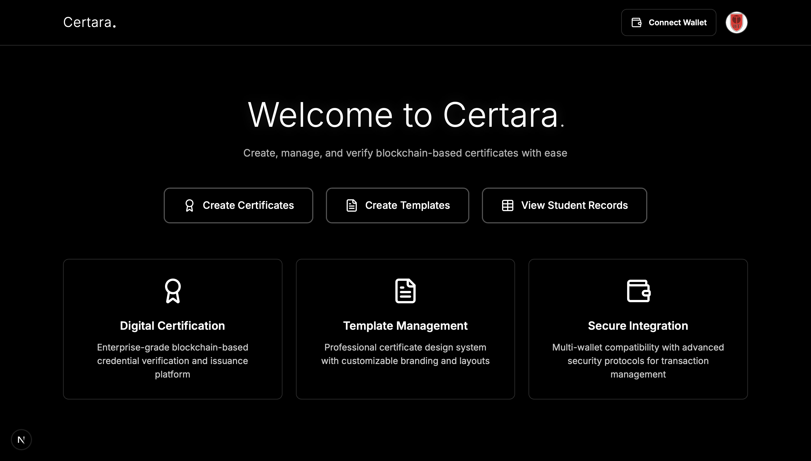

# Certara: Revolutionize Your Certificates With Blockchain-Backed Authencity

<br>



<br>

Link To The YouTube Video: https://youtu.be/nF4MoL6m6vY

## Getting Started

The essential procedures required for initiating and configuring the project within your local environment.

### Prerequisites

1. Upgrade the Node Package Manager (npm) to the latest release version.

   ```sh
   npm install -g npm@latest
   ```

### Installation

1. Clone the repository and retrieve it on the local machine.

    ```sh
    git clone https://github.com/CoinCeylon/Certara.git
    ```

2. Navigate your project folder directory.

    ```sh
    cd project
    ```

3. Install the required Node Package Manager (npm) packages and dependencies.

   ```sh
   npm install
   ```

4. Enter your environmental variables within the `.env` file. Use the `.env.sample` file as a reference.

    ```js
    MONGODB_URI= "Enter Your MongoDB Connection URL"

    ADMIN_EMAIL= "Enter Your Admin Login Email Address"
    ADMIN_PASSWORD= "Enter Your Admin Login Password"

    EMAIL_ADDRESS= "Enter Your Gmail Address To Use As An SMTP For OTPs (One Time Password)"
    EMAIL_PASSWORD= "Enter The App Password Generated For The Above Gmail Address"

    NEXT_PUBLIC_BLOCKFROST_PROJECT_ID= "Enter Your BlockFrost Project Identification For Cardano API Access (PreProd)"
    ``` 

5. Launch the application via localhost, and then access it through the browser.

   ```sh
   npm run dev
   ```

6. Enter Your Admin Email Address and Admin Password In The Sign-In Form which will redirect you to the Admin Page (Signup New Users And View Existing Organisations)

## License

This repository is distributed under the Apache 2.0 License. See `LICENSE` for additional information.